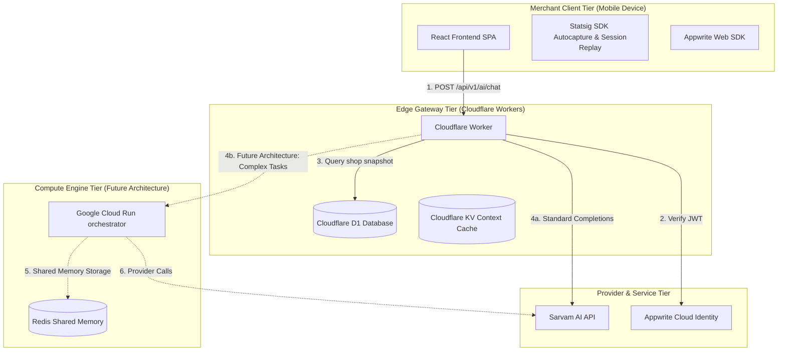
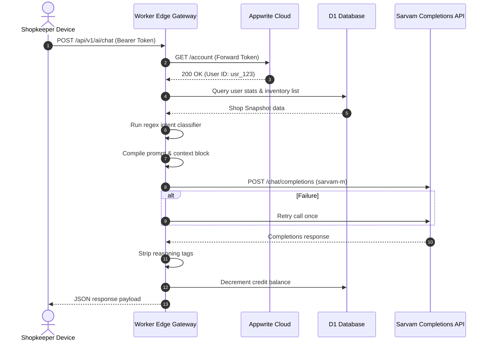
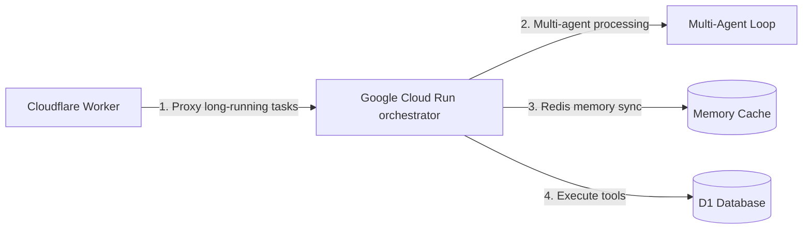
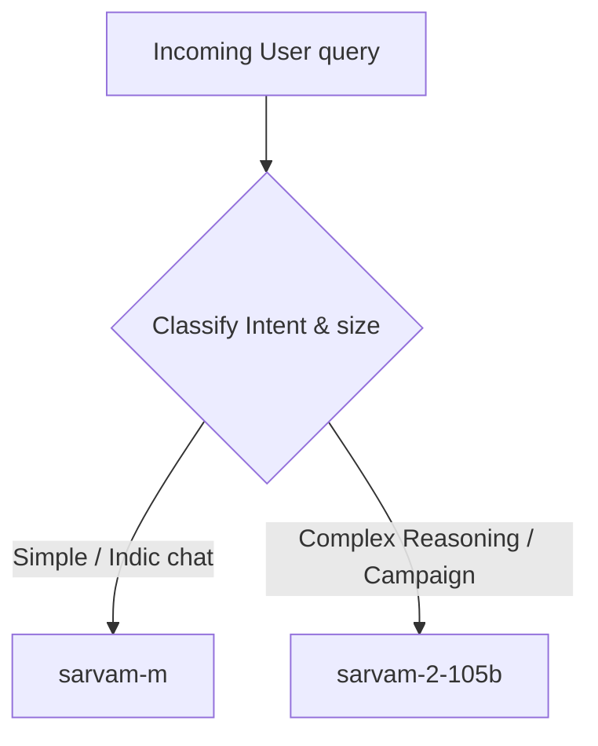
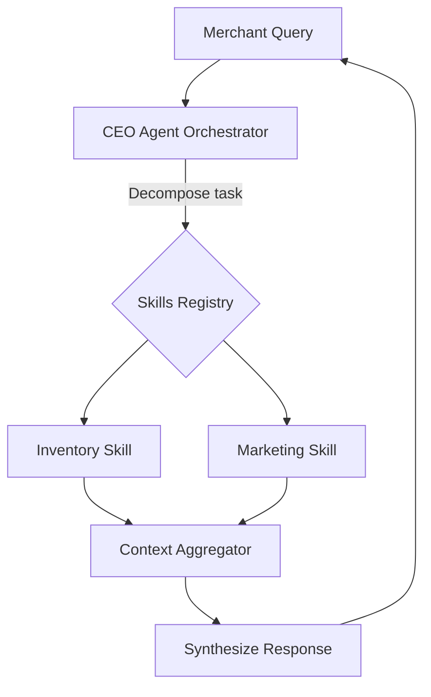
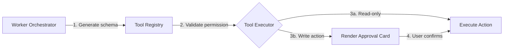
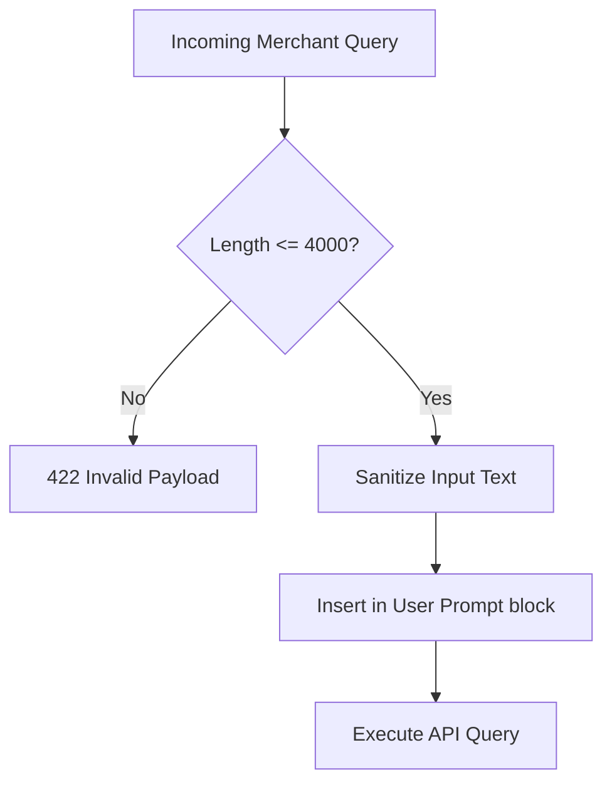
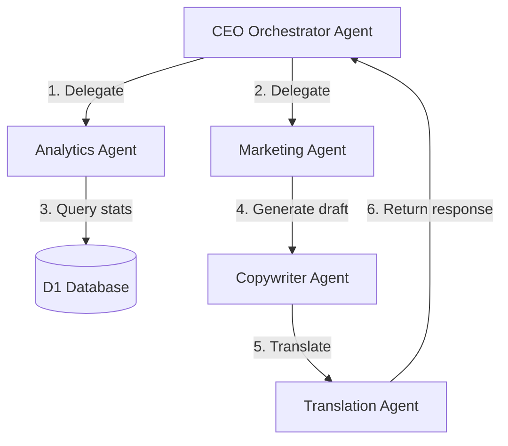

# FeraSetu AI Master Architecture Specification (FERASETU_AI.md)

This document serves as the absolute technical reference and master blueprint for the entire artificial intelligence infrastructure of FeraSetu. It details the design philosophies, current system implementations, and future planned architectures (clearly designated) across our frontend, edge computing network, and backend services.

---

## 1. Vision & Objectives

FeraSetu's AI infrastructure is designed to bridge the digital divide for small and micro-retailers (such as Kirana store owners) across India. Our vision is to democratize institutional-grade enterprise intelligence—typically reserved for large retail chains—and deploy it on inexpensive Android hardware over variable mobile networks.

FeraSetu AI (publicly exposed to the merchant as **Fera AI**) functions not as a generic conversational chatbot, but as an embedded, proactive, and context-aware business operations manager. 

The primary business objectives of Fera AI are:
1. **Friction Elimination**: Allow non-technical merchants to manage inventories, create websites, and compile financial reports using natural spoken language.
2. **Sales Generation**: Proactively construct marketing campaigns and customer outreach messages tailored to local buying patterns.
3. **Operational Safeguarding**: Prevent critical supply chain failures (such as stockouts) and assist with administrative bookkeeping.

---

## 2. AI Philosophy

Our AI design principles are centered around the realities of micro-retail business owners:

*   **Single Unified Interface**: The merchant must never be forced to navigate multiple agents or assistants. One unified persona, **Fera AI**, is the sole interface. Behind this interface, a central router coordinates internal specialist skills.
*   **Deterministic Fallbacks Over Generative AI**: Where business logic or factual calculations are needed, the system relies on deterministic database operations and code rather than generative LLMs. LLMs are used for semantic classification, language translation, context synthesis, and generation of customer-facing copy.
*   **Language Inclusivity (Indic-First)**: The user interface prioritizes localized speech-to-text input, code-mixed language parsing (e.g., Hinglish, Tamilish), and high-fidelity Indic language translation.
*   **Human-in-the-Loop Safeguards**: AI systems operate on a tiered risk model. Any action that alters state (such as product creation, price modifications, or customer-facing broadcasts) requires explicit user verification via interactive approval cards. Read-only actions execute automatically.
*   **Contextual Sufficiency**: We avoid dumping raw databases or entire historical logs into prompt windows. The system dynamically constructs compressed, structured context blocks containing only the information needed to resolve the current task.

---

## 3. Why FeraSetu AI Exists

Traditional software systems require merchants to navigate nested forms, complex tabular dashboards, and configuration panels. For a traditional Kirana shopkeeper using an inexpensive mobile device, this creates a significant barrier to entry.

FeraSetu AI resolves this by:
*   Translating language-based commands directly into system actions (e.g., "Add 5 boxes of Maggi to my inventory").
*   Analyzing raw tabular sales data and summarizing it in plain language (e.g., "Your sales increased 12% this week because of your Diwali discounts").
*   Lowering the cognitive overhead of digital business management, transforming a complex SaaS application into a simple conversation.

---

## 4. Complete AI Architecture

The system operates across three tiers:
1.  **Frontend Single-Page Application (SPA)**: Runs on the merchant's mobile device. Manages chat state, records audio input, renders Markdown responses, and prompts for action approvals.
2.  **Cloudflare Worker (Edge Gateway)**: Handles high-throughput operations. Manages Appwrite JWT authentication checks, executes D1 database lookups to compile shop snapshots, and routes requests to the AI model provider.
3.  **Google Cloud Run Microservices (Future Architecture)**: A planned high-resource execution tier designed for long-running multi-step reasoning tasks, complex data processing, and multi-agent coordination.

---

## 5. High-Level System Diagram



---

## 6. Folder Structure

The code layout separates Edge Gateway routers, internal skills, and frontend UI pages:

```
ferasetu/
├── worker/                           # Edge Gateway Tier
│   ├── index.js                      # Gateway entry, route definitions, D1 SQL, and base orchestrator
│   └── ai/                           # AI Core Logic
│       ├── router.ts                 # Task-based model router
│       ├── providers/
│       │   └── sarvam.ts             # Wrapper for Sarvam API interactions
│       └── skills/
│           ├── shared.ts             # Standard types and sanitizers
│           ├── orchestrator.ts       # Intent classification and prompt coordination
│           └── chat-handler.ts       # Cloud Run orchestrator interface definitions
│
├── frontend/                         # Client Tier
│   └── src/
│       ├── App.tsx                   # Route definitions & Statsig wrapper
│       ├── components/
│       │   └── Layout.tsx            # Navigation layout injecting Fera AI
│       ├── pages/
│       │   ├── FeraAIPage.tsx        # Fera AI interactive chat view
│       │   └── AIAssistantPage.tsx   # Legacy assistant page
│       └── utils/
│           └── languages.ts          # Localization mappings
│
└── tests/
    └── fera-ai.test.mjs              # Test suite covering auth, isolation, and intent
```

---

## 7. File-by-File Specifications

### 7.1. Edge Gateway & Orchestrator: `worker/index.js`
*   **Purpose**: Acts as the HTTP entry point and API router at the edge. It verifies JWT credentials via Appwrite, loads shop snapshots, runs deterministic intent checks, coordinates prompts, calls the AI provider, and manages credit deductions.
*   **Imports**: Implictly routes files.
*   **Exports**: Cloudflare Worker standard default handler (`fetch`).
*   **Execution Order**:
    1. Validate authorization token.
    2. Read request body.
    3. Query database for merchant details.
    4. Enforce credit checks.
    5. Run regex-based intent classification.
    6. Formulate system prompts and contextual parameters.
    7. Execute completion request with retry patterns.
    8. Write audit logs and decrement credits.
    9. Return JSON payload.
*   **Dependencies**: Cloudflare D1 database and external Appwrite API endpoints.
*   **Future Refactoring**: Migrate this file from pure JavaScript to TypeScript and compile with ESBuild to match the `worker/ai` module directory.

### 7.2. Intent Classifier & Orchestration Manager: `worker/ai/skills/orchestrator.ts`
*   **Purpose**: Contains the TypeScript version of intent routing, prompt synthesis, and execution coordination.
*   **Imports**: `shared.ts`, `router.ts`.
*   **Exports**: `runOrchestrator(req: OrchestratorRequest): Promise<OrchestratorResponse>`.
*   **Dependencies**: `worker/ai/router.ts`.
*   **Future Refactoring**: Integrate with database tables to enable multi-turn memory lookup directly from the edge.

### 7.3. Client Chat View: `frontend/src/pages/FeraAIPage.tsx`
*   **Purpose**: User interface for Fera AI. Handles message list rendering, quick-action selectors, speech-to-text triggers, and interactive approval cards.
*   **Imports**: `api.ts`, `AuthContext.tsx`.
*   **Exports**: `FeraAIPage` React component.
*   **Dependencies**: Lucide React icons, TanStack Query hooks, Tailwind CSS layout systems.
*   **Future Refactoring**: Extract the custom UI bubbles, approval panels, and quick actions into reusable component files.

---

## 8. AI Request Lifecycle



---

## 9. Frontend Architecture

The frontend is built as a single-page application using React, Vite, and Tailwind CSS. It is designed to run efficiently on lower-spec mobile devices with constrained network bandwidth.

*   **State Management**: Uses React state for real-time conversation records and TanStack Query for network mutation requests.
*   **Visual Presentation**: Implements a dark mode color palette (backgrounds range from `#060818` to `#080D1E`) to minimize screen-glare and battery drain.
*   **Audio Recording**: Utilizes the native browser Web Speech API for real-time Indic voice speech-to-text (STT) transcription.
*   **Statsig Instrumentation**: Wraps the root layout in `StatsigProvider` to capture merchant interactions and collect user analytics.

---

## 10. Cloudflare Worker Architecture

Cloudflare Workers serve as the edge gateway layer of our backend:

*   **V8 Isolates**: Requests are executed in sandboxed V8 isolates, minimizing cold-start latency compared to traditional containerized serverless functions.
*   **Edge Database Binding**: The worker connects directly to the Cloudflare D1 database over regional networks.
*   **Credit Verification & Deductions**: The edge gateway checks the merchant's credit balance before processing any request. Credits are decremented in a non-blocking query after the AI completion response is successfully parsed.
*   **Fault-Tolerant Retries**: If the AI completions API returns a transient error code (e.g., 502, 503, or 504), the worker catches the exception and immediately retries the request once after an 800ms backoff delay.

---

## 11. Google Cloud Run Architecture (Future Architecture)

For advanced operations requiring deep reasoning, long execution runtimes, or multi-agent loops, we plan to route requests through a containerized backend on Google Cloud Run.



*   **Containerized Environment**: Runs container images containing specialized tool compilers, data analysis libraries, and orchestration code.
*   **Scale-to-Zero Deployment**: Scales instances dynamically to minimize infrastructure costs when idle.
*   **Shared Memory Cache**: Integrates with a Redis instance to maintain context across multi-agent processing steps.

---

## 12. Appwrite Authentication

FeraSetu uses Appwrite Cloud for identity management:

*   **Edge Validation**: The edge gateway verifies authorization tokens against the Appwrite API on every incoming request.
*   **Authentication Token Processing**: The frontend generates a JWT by calling `account.createJWT()` and includes it as a Bearer token in the `Authorization` header.
*   **Worker Middleware Verification**: The worker parses the token and forwards it to Appwrite's `/account` endpoint using the `X-Appwrite-JWT` header. If valid, Appwrite returns the user's profile containing their ID, email, and name.

---

## 13. Tenant Isolation

We enforce strict tenant isolation at the database layer to ensure data security:

*   **Token-Derived Tenancy**: The database query scopes are derived directly from the verified Appwrite account ID, preventing spoofing attempts from the client.
*   **Scoped Database Queries**: All product, order, and meeting queries append a `user_id = ?` bind parameter to isolate data between merchants:
    ```sql
    SELECT * FROM products WHERE user_id = ? ORDER BY created_at DESC;
    ```
*   **Strict Parameter Validation**: Any tenant identifier provided in the HTTP request body is ignored by the database client.

---

## 14. AI Router

The AI Router (`worker/ai/router.ts`) selects the optimal model based on task complexity and size:



*   **Simple Queries**: Routes standard conversational messages to `sarvam-m` for fast, cost-efficient responses.
*   **Complex Tasks**: Re-routes marketing campaign generations and long analytical queries to `sarvam-2-105b`.
*   **Indic Optimizations**: Configures request formatting parameters specifically for Indic language processing.

---

## 15. Supported Models

We support the following models:

| Model Name | Host | Context Window | Use Case |
|------------|------|----------------|----------|
| `sarvam-m` | Sarvam AI | 8k tokens | Standard chat, translation, search queries |
| `sarvam-2-105b` | Sarvam AI | 32k tokens | Complex campaign planning, data analysis |

---

## 16. Model Selection Strategy

We select models based on the classified intent:

*   **Indic Language Conversational Chat**: Standardizes on `sarvam-m` for Indic language processing and conversational speed.
*   **Translation Tasks**: Uses `sarvam-m` to translate product details and listings into localized Indian dialects.
*   **Campaign and Content Generation**: Uses `sarvam-2-105b` for complex planning, marketing copy generation, and data synthesis.

---

## 17. CEO Agent (Future Architecture)

In the planned future architecture, a central **CEO Agent** will manage task execution:



*   **Central Coordinator**: The CEO Agent parses the user's intent, breaks it down into subtasks, and assigns them to specialized skills.
*   **Response Synthesis**: It reviews the output from each subtask and formats it into a single, cohesive response for the merchant.
*   **Execution Monitoring**: It tracks request latency and retries failed subtasks dynamically.

---

## 18. Internal AI Skills

Our AI features are organized into specialized modular skills:

```carousel
### Marketing Campaign Skill
- **Purpose**: Generates marketing copy and whatsapp campaigns.
- **Inputs**: Top-selling products, discount values, seasonal context.
- **Outputs**: Promo copy, target customer segments, launch schedules.
- **Permission Level**: Write-access (Requires user approval).

<!-- slide -->
### Inventory Analysis Skill
- **Purpose**: Identifies low-stock products and suggests restock amounts.
- **Inputs**: Current stock levels, safety thresholds, sales velocity.
- **Outputs**: Reorder recommendations, stockout warnings.
- **Permission Level**: Read-only (Executes automatically).

<!-- slide -->
### Translation Skill
- **Purpose**: Translates listings between English and Indic languages.
- **Inputs**: Source text, target language code.
- **Outputs**: Translated text with original numbers and SKUs preserved.
- **Permission Level**: Read-only (Executes automatically).
```

---

## 19. Shared AI Memory (Future Architecture)

To support long-running business goals, the system will implement a shared memory architecture:

*   **Long-Term Goal Memory**: Stores the merchant's business goals (e.g., "Increase sales by 10% this month") in a dedicated D1 database table.
*   **Session State Storage**: Temporarily stores active conversation contexts using Cloudflare KV.
*   **Vector Embeddings Database (Future Architecture)**: We plan to store and query historical business data using vector search databases.

---

## 20. AI Context Builder

The AI Context Builder constructs a structured, text-based snapshot of the store's current state:

```
SHOP: Ramesh Store (Plan: beta)
PRODUCTS: 45 total, 3 low stock, 1 out of stock
TOP PRODUCTS: Rice 5kg (₹250, stock: 3), Dal 1kg (₹120, stock: 0)
ORDERS TODAY: 4 orders, ₹850 revenue
ORDERS THIS WEEK: 22 orders, ₹5,400 revenue
PENDING ORDERS: 2
```

This structured snapshot provides the AI model with all necessary store details without sending the full database contents.

---

## 21. Prompt Architecture

Our prompts use a structured format to isolate system instructions from merchant data:

```
[SYSTEM PROMPT]
You are Fera AI, a business assistant...
- Never invent business metrics.
- Keep responses under 3 bullet points.
- Respond in the merchant's chosen language.

[USER PROMPT]
SHOP DATA:
<Snapshot constructed by Context Builder>

RECENT CONVERSATION:
<Last 6 chat turns>

SHOPKEEPER: <Sanitized merchant query>
```

This structure helps prevent prompt injection by isolating user inputs from system guidelines.

---

## 22. Tool Registry & Execution (Future Architecture)

For actions requiring system changes, we plan to implement a structured tool execution registry:



*   **Structured Output Generation**: The model returns tool calls as structured JSON payloads.
*   **Permission Verification**: The gateway checks the required permission level before running the tool.
*   **State Modifications**: Actions that modify data are queued and only run after the merchant approves the action on the frontend.

---

## 23. Approval Engine

Tiered safety mechanisms protect store data:

*   `read_only`: Actions like viewing analytics or scanning stock levels execute instantly without confirmation.
*   `reversible_write`: Actions like drafting product listings display an in-line edit window for quick merchant adjustments.
*   `sensitive`: Actions modifying core store data (e.g. updating product pricing or dispatching campaigns) require the merchant to click an explicit **Confirm** button.

---

## 24. Database Design

Here is the database schema used for AI features and credit tracking:

### D1 `users` Table Modifications
```sql
ALTER TABLE users ADD COLUMN ai_credits_balance INTEGER DEFAULT 10;
ALTER TABLE users ADD COLUMN ai_credits_used_month INTEGER DEFAULT 0;
ALTER TABLE users ADD COLUMN preferred_language TEXT DEFAULT 'en';
```

### Planned AI Tables (Future Architecture)
```sql
CREATE TABLE ai_conversations (
    id TEXT PRIMARY KEY,
    user_id TEXT NOT NULL,
    created_at TEXT NOT NULL,
    updated_at TEXT NOT NULL
);

CREATE TABLE ai_messages (
    id TEXT PRIMARY KEY,
    conversation_id TEXT NOT NULL,
    role TEXT NOT NULL, -- 'user' or 'assistant'
    content TEXT NOT NULL,
    skills_used TEXT, -- JSON array
    model TEXT,
    created_at TEXT NOT NULL
);

CREATE TABLE ai_audit_logs (
    id TEXT PRIMARY KEY,
    user_id TEXT NOT NULL,
    request_id TEXT NOT NULL,
    action_type TEXT NOT NULL,
    details TEXT,
    latency_ms INTEGER,
    created_at TEXT NOT NULL
);
```

---

## 25. AI Security



*   **Edge Input Validation**: The gateway rejects queries exceeding 4000 characters.
*   **Appwrite-derived Scoping**: We never use client-provided user IDs. The active user ID is derived directly from the verified Appwrite session token.
*   **Prompt Injection Protection**: Unsanitized user inputs are placed strictly inside user query blocks, preventing them from overriding system-level instructions.

---

## 26. UX Psychology for Shopkeepers

The chat interface is designed around the needs of small merchants:

*   **Minimized Text Input**: Renders quick-action option buttons, letting merchants run common queries with a single tap.
*   **Simple Conversational Tone**: Fera AI communicates like a friendly, practical business advisor, avoiding complex corporate jargon.
*   **Structured Recommendations**: The AI limits recommendations to a maximum of 3 per response, ending with one clear, actionable next step.

---

## 27. Planned Subsystems & AI Modules

We plan to implement the following specialized modules:

### 27.1. Customer AI & Shopping Assistant (Future Architecture)
A buyer-facing assistant embedded in the merchant's store website.
*   **Purpose**: Helps buyers find products, check stock, and ask questions about shipping.
*   **Permissions**: Read-only database access.

### 27.2. Admin AI (Future Architecture)
An internal dashboard assistant for platform operators.
*   **Purpose**: Summarizes metrics, visualizes signup trends, and flags high-latency API endpoints.

### 27.3. Automation Engine (Future Architecture)
A workflow runner that triggers actions based on store events.
*   **Purpose**: Automates tasks like sending low-stock alerts or thank-you messages to buyers.
*   **Security**: Requires explicit merchant authorization during setup.

---

## 28. Future Multi-Agent Architecture



In future phases, the system will move to a multi-agent structure:
*   **CEO Coordinator**: The main coordinator parses queries and delegates tasks to specialized sub-agents.
*   **Specialist Agents**: Specialized sub-agents (e.g. Analytics, Marketing, Copywriting, Translation) operate in isolated runtime loops to resolve their assigned tasks.
*   **Unified Response**: The CEO agent combines their outputs into a single, cohesive message for the merchant.

---

## 29. Infrastructure & Deployment

The AI infrastructure is deployed on Cloudflare:

*   **Environment Variables**: Worker secrets (e.g., `SARVAM_API_KEY`, `APPWRITE_PROJECT_ID`) are managed securely via Wrangler.
*   **Wrangler Deployment**:
    ```bash
    npx wrangler deploy
    ```
*   **Logging & Observability**: API latency, errors, and model usage metrics are written to Cloudflare logs as structured JSON payloads for monitoring.
*   **Cost Control**: The worker enforces strict daily rate limits per merchant ID to keep API costs predictable.

---

## 30. Testing Strategy

The test suite (`tests/fera-ai.test.mjs`) validates core AI functions using mock database connections:

```bash
node tests/fera-ai.test.mjs
```

The tests cover:
- Appwrite JWT authorization headers.
- Intent classification regex patterns.
- AI credit validation rules.
- Tenant isolation and scoping.
- Prompt injection protection.
