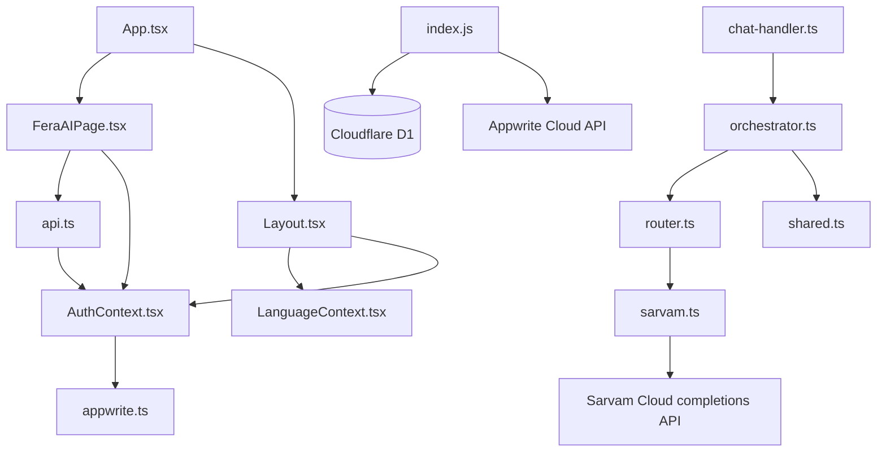
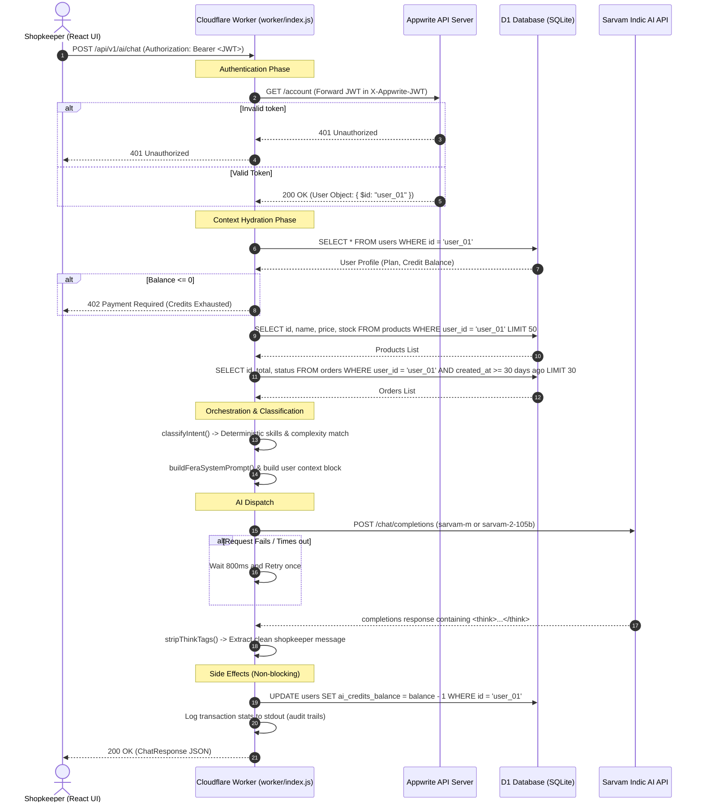

# Fera AI — Complete Developer Architecture Specification

This specification document describes the architecture, codebase layout, request lifecycles, and security protocols of the **Fera AI System** in the FeraSetu platform.

---

## 1. Directory Structure & System Layout

Below is the directory layout of the Fera AI related source files.

```
/workspaces/ferasetu/
├── docs/
│   └── FERA_AI.md                   # Core user/deploy guide
│
├── tests/
│   └── fera-ai.test.mjs             # 32-test unit & integration test suite
│
├── worker/                          # Cloudflare Worker Edge Gateway
│   ├── index.js                     # Gateway Entrypoint, Auth & D1 SQL client, v1 AI Routes
│   ├── wrangler.toml                # Edge configuration & D1 database bindings
│   └── ai/                          # AI Core Module
│       ├── router.ts                # Model Router & Task-to-Model Selector
│       ├── providers/
│       │   └── sarvam.ts            # Sarvam API REST wrapper
│       └── skills/
│           ├── shared.ts            # Context Builders, Types, & String Sanitizers
│           ├── orchestrator.ts      # TypeScript implementation of intent classification
│           └── chat-handler.ts      # Blueprint for future external orchestrator microservice
│
└── frontend/                        # React Single Page Application (SPA)
    ├── package.json                 # Node dependencies (Statsig & Lucide packages)
    ├── src/
    │   ├── App.tsx                  # Root Routing, Code-Splitting, & Statsig SDK initialization
    │   ├── components/
    │   │   └── Layout.tsx           # Application navigation structure (promotes Fera AI)
    │   ├── contexts/
    │   │   ├── AuthContext.tsx      # Appwrite session provider
    │   │   └── LanguageContext.tsx  # Indic localizer context
    │   ├── pages/
    │   │   ├── FeraAIPage.tsx       # Fera AI main chat user interface
    │   │   └── AIAssistantPage.tsx  # Legacy AI page (kept for compatibility)
    │   ├── services/
    │   │   └── api.ts               # Axios base wrapper supporting Bearer JWT injection
    │   └── utils/
    │       └── languages.ts         # Multi-lingual local dictionary
```

---

## 2. File Dependency Map & Import Graph



---

## 3. Request Lifecycle & Execution Flow



---

## 4. API Endpoints Specification

### 4.1. POST `/api/v1/ai/chat`
The main entrance point of the Fera AI system.

*   **Authentication**: Required (JWT Bearer Token).
*   **Request Headers**:
    ```http
    Authorization: Bearer <appwrite-jwt-token>
    Content-Type: application/json
    ```
*   **Request Body**:
    ```json
    {
      "message": "Give me a campaign idea for my low stock products",
      "language": "hi",
      "conversationHistory": [
        { "role": "user", "content": "hello Fera" },
        { "role": "assistant", "content": "Namaste! How can I help you?" }
      ]
    }
    ```
*   **Response Body**:
    ```json
    {
      "content": "Here is an idea: Offer a 10% discount on Rice 5kg...",
      "model": "sarvam-m",
      "skillsUsed": ["marketing", "inventory"],
      "hasProposedActions": false,
      "proposedActions": [],
      "requestId": "5e1e1273-04a4-4f81-ba09-5cfca9b699c2",
      "latencyMs": 1420,
      "aiCreditsBalance": 9
    }
    ```

### 4.2. GET `/api/v1/health`
Health verification checking worker status and API version.

*   **Authentication**: None.
*   **Response Body**:
    ```json
    {
      "status": "ok",
      "version": "2.0.0",
      "service": "fera-ai",
      "timestamp": "2026-08-06T04:42:00.000Z"
    }
    ```

---

## 5. Worker API (Edge Gateway) Implementation Detail

The file `worker/index.js` acts as the system gateway. It implements the following logic:

### 5.1. Context Retrieval Functions
*   `loadShopContextFromD1(userId, db)`: Retrieves shopkeeper data from D1.
    *   **SQL Isolation**: Standardizes queries by appending `WHERE user_id = ?` to isolate tenants.
    *   **Return Contract**: Returns a structured object showing total product counts, low stock counts, out of stock counts, weekly/today order metrics, and the latest orders.

### 5.2. Core Orchestrator Logic
*   `classifyIntent(message, language)`: Inspects incoming user messages via regular expressions to route incoming tasks:
    *   **Stock/Inventory**: Returns `skills: ['inventory']` (routes to `sarvam-m`).
    *   **Diwali/WhatsApp/Campaign**: Returns `skills: ['marketing', 'content']` (marked `isComplex: true` -> routes to `sarvam-2-105b`).
    *   **Translate**: Returns `skills: ['translation']` (routes to `sarvam-m`).
    *   **Fallback**: Returns `skills: ['business_coach']`.
*   `buildFeraSystemPrompt(language, skills)`: Matches language code to language names and injects the Fera AI personality and rules context.
*   `callSarvamAI({ messages, model, isComplex, sarvamApiKey, requestId })`: Dispatches HTTP request to the external AI endpoint. Implements timeout values:
    *   Simple task: 30 seconds.
    *   Complex task (`sarvam-2-105b`): 90 seconds.
*   `handleV1AIChat(request, env)`: The master handler. Handles validation, checks credits, triggers AI invocation with a single retry pattern, deducts credit, writes audit log events to worker logs, and returns the response.

---

## 6. React UI Components Detail

### 6.1. `FeraAIPage.tsx`
*   **Aesthetics**: Glassmorphism dark layout (`#060818` to `#080D1E`) to reduce eye-strain on low-end mobile devices.
*   **Quick Actions Selector Grid**: Offers immediate, non-keyboard click entries divided into 6 distinct categories (Sell More, Manage Shop, Customers, Create, Automate, Insights).
*   **Speech Recognition Interfacing**: Interfaces with native `window.SpeechRecognition` to support voice-to-text inputs.
*   **Proposed Actions Approvals**: Displays pending tasks that modify database fields (e.g. creating discounts) via explicit inline confirm/cancel cards before committing.

### 6.2. `Layout.tsx`
*   **Aesthetic Highlight**: Adds a prominent Sparkles icon next to the new "Fera AI" navigation link in the side navigation panel.
*   **Localization Dynamic Routing**: Uses `LanguageContext` to translate the sidebar navigation title correctly across different languages.

---

## 7. Security Mechanisms

1.  **JWT Scoped Database Access**: Frontend-supplied parameters are ignored. D1 queries strictly use the `$id` field returned directly from Appwrite identity checks.
2.  **AI Credit Deduct Lock**: Before processing AI queries, the system checks whether the user has credits left. If `ai_credits_balance <= 0`, requests are blocked immediately.
3.  **Prompt Injection Isolation**: User input text is placed strictly into a separate user message blocks rather than system instructions.
4.  **Character Limit Safeguard**: Messages over 4000 characters are rejected at the edge gateway level.

---

## 8. Recommendations for Future Refactoring

*   **Move worker to TypeScript**: The worker `index.js` is currently pure JavaScript. Refactor this to TypeScript, compiling and combining files like `orchestrator.ts` and `chat-handler.ts` into a single worker bundle.
*   **Context Caching**: Implement Cloudflare KV caching for `loadShopContextFromD1` with a short (e.g. 30-second) Time-to-Live (TTL) to avoid redundant SQL queries on rapid message exchanges.
*   **Async Queueing**: For long-running complex operations, adopt Cloudflare Queues to execute tasks in the background and use WebSockets or server-sent events (SSE) to update the frontend.
