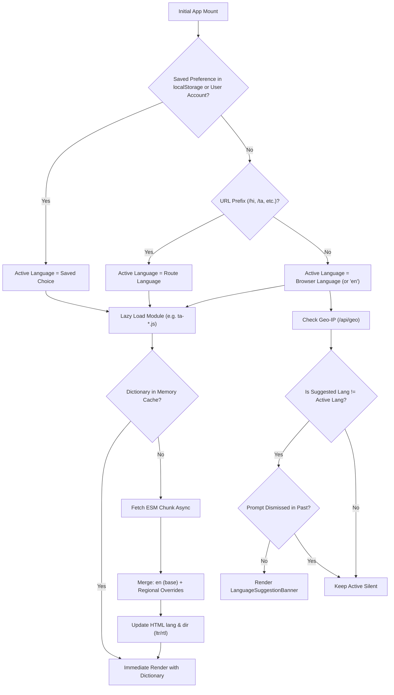

# FeraSetu Global Localization System (48 Targets)
### Master Engineering, Architecture & Operational Guide

---

## 1. Executive Summary & Core Principles

FeraSetu is a global commerce platform designed to empower hyper-local merchants and independent entrepreneurs across India, the European Union, the United States, and international markets. A core competitive moat of FeraSetu is native language accessibility: merchants and their customers can interact with the platform in their mother tongue with zero technical overhead.

### Target Language Coverage (48 Distinct Localization Targets)
1. **US English (`en`)**: Primary default / canonical source language.
2. **Hinglish (`hi-latn`)**: Colloquial Hindi written in Roman/Latin script with conversational English blend.
3. **All 22 Scheduled Indian Languages**: Eighth Schedule of the Constitution of India.
4. **All 24 Official European Union (EU) Languages**: Bulgarian, Croatian, Czech, Danish, Dutch, English (Europe), Estonian, Finnish, French, German, Greek, Hungarian, Irish, Italian, Latvian, Lithuanian, Maltese, Polish, Portuguese, Romanian, Slovak, Slovenian, Spanish, Swedish.

### Core Architecture Principles
* **Explicit User Choice Always Wins**: A merchant's or buyer's manually selected language preference is authoritative and takes precedence over IP location, browser headers, or automated predictions.
* **Privacy-Conscious Suggestion, Never Coercion**: We never silently force a language based on IP geolocation. When an Indian user in Tamil Nadu visits with an English browser, FeraSetu renders in English and displays an unobtrusive, easily dismissible Google-Translate-style suggestion pill (`English → தமிழ்`).
* **Zero GPS / Geolocation API Invasiveness**: We strictly avoid invasive browser HTML5 GPS prompts. Coarse country and subdivision data is derived securely server-side via Cloudflare edge headers (`CF-IPCountry`, `CF-Region`).
* **High-Performance Dynamic Chunking**: Language dictionaries are code-split into independent lazy-loaded ESM chunks. Visiting the site in English does not load 47 other dictionaries; switching to Tamil downloads only the Tamil dictionary bundle on demand.
* **Universal Resilience & English Fallback**: If a newly added key is missing in a regional language dictionary, the system automatically falls back to English without crashing or displaying empty strings.

---

## 2. Complete 48-Language Matrix

| # | Code | BCP 47 Locale | Native Name | English Name | Script | Dir | Region | Flag | Classification |
|---|---|---|---|---|---|---|---|---|---|
| 1 | `en` | `en-US` | English | English (US) | Latin | LTR | Global | 🇺🇸 | Source / Canonical |
| 2 | `hi-latn` | `hi-Latn-IN` | Hinglish | Hinglish | Latin | LTR | India | 🇮🇳 | Colloquial Blend |
| 3 | `as` | `as-IN` | অসমীয়া | Assamese | Eastern Nagari | LTR | India | 🇮🇳 | Eighth Schedule (India) |
| 4 | `bn` | `bn-IN` | বাংলা | Bengali | Bengali | LTR | India | 🇮🇳 | Eighth Schedule (India) |
| 5 | `brx` | `brx-IN` | बड़ो | Bodo | Devanagari | LTR | India | 🇮🇳 | Eighth Schedule (India) |
| 6 | `doi` | `doi-IN` | डोगरी | Dogri | Devanagari | LTR | India | 🇮🇳 | Eighth Schedule (India) |
| 7 | `gu` | `gu-IN` | ગુજરાતી | Gujarati | Gujarati | LTR | India | 🇮🇳 | Eighth Schedule (India) |
| 8 | `hi` | `hi-IN` | हिन्दी | Hindi | Devanagari | LTR | India | 🇮🇳 | Eighth Schedule (India) |
| 9 | `kn` | `kn-IN` | ಕನ್ನಡ | Kannada | Kannada | LTR | India | 🇮🇳 | Eighth Schedule (India) |
| 10 | `ks` | `ks-IN` | کٲشُر | Kashmiri | Nastaliq/Perso-Arabic | RTL | India | 🇮🇳 | Eighth Schedule (India) |
| 11 | `gom` | `kok-IN` | कोंकणी | Konkani | Devanagari | LTR | India | 🇮🇳 | Eighth Schedule (India) |
| 12 | `mai` | `mai-IN` | मैथिली | Maithili | Devanagari | LTR | India | 🇮🇳 | Eighth Schedule (India) |
| 13 | `ml` | `ml-IN` | മലയാളം | Malayalam | Malayalam | LTR | India | 🇮🇳 | Eighth Schedule (India) |
| 14 | `mni` | `mni-IN` | ꯃꯤꯇꯩꯂꯣꯟ | Manipuri (Meitei) | Meetei Mayek | LTR | India | 🇮🇳 | Eighth Schedule (India) |
| 15 | `mr` | `mr-IN` | मराठी | Marathi | Devanagari | LTR | India | 🇮🇳 | Eighth Schedule (India) |
| 16 | `ne` | `ne-IN` | नेपाली | Nepali | Devanagari | LTR | India | 🇳🇵 | Eighth Schedule (India) |
| 17 | `or` | `or-IN` | ଓଡ଼ିଆ | Odia | Odia | LTR | India | 🇮🇳 | Eighth Schedule (India) |
| 18 | `pa` | `pa-IN` | ਪੰਜਾਬੀ | Punjabi | Gurmukhi | LTR | India | 🇮🇳 | Eighth Schedule (India) |
| 19 | `sa` | `sa-IN` | संस्कृतम् | Sanskrit | Devanagari | LTR | India | 🇮🇳 | Eighth Schedule (India) |
| 20 | `sat` | `sat-IN` | ᱥᱟᱱᱛᱟᱲᱤ | Santali | Ol Chiki | LTR | India | 🇮🇳 | Eighth Schedule (India) |
| 21 | `sd` | `sd-IN` | سنڌي | Sindhi | Perso-Arabic | RTL | India | 🇮🇳 | Eighth Schedule (India) |
| 22 | `ta` | `ta-IN` | தமிழ் | Tamil | Tamil | LTR | India | 🇮🇳 | Eighth Schedule (India) |
| 23 | `te` | `te-IN` | తెలుగు | Telugu | Telugu | LTR | India | 🇮🇳 | Eighth Schedule (India) |
| 24 | `ur` | `ur-IN` | اردو | Urdu | Nastaliq/Perso-Arabic | RTL | India | 🇮🇳 | Eighth Schedule (India) |
| 25 | `bg` | `bg-BG` | Български | Bulgarian | Cyrillic | LTR | EU | 🇧🇬 | Official EU Language |
| 26 | `hr` | `hr-HR` | Hrvatski | Croatian | Latin | LTR | EU | 🇭🇷 | Official EU Language |
| 27 | `cs` | `cs-CZ` | Čeština | Czech | Latin | LTR | EU | 🇨🇿 | Official EU Language |
| 28 | `da` | `da-DK` | Dansk | Danish | Latin | LTR | EU | 🇩🇰 | Official EU Language |
| 29 | `nl` | `nl-NL` | Nederlands | Dutch | Latin | LTR | EU | 🇳🇱 | Official EU Language |
| 30 | `en-gb` | `en-GB` | English (EU) | English (Europe) | Latin | LTR | EU | 🇪🇺 | Official EU Language |
| 31 | `et` | `et-EE` | Eesti | Estonian | Latin | LTR | EU | 🇪🇪 | Official EU Language |
| 32 | `fi` | `fi-FI` | Suomi | Finnish | Latin | LTR | EU | 🇫🇮 | Official EU Language |
| 33 | `fr` | `fr-FR` | Français | French | Latin | LTR | EU | 🇫🇷 | Official EU Language |
| 34 | `de` | `de-DE` | Deutsch | German | Latin | LTR | EU | 🇩🇪 | Official EU Language |
| 35 | `el` | `el-GR` | Ελληνικά | Greek | Greek | LTR | EU | 🇬🇷 | Official EU Language |
| 36 | `hu` | `hu-HU` | Magyar | Hungarian | Latin | LTR | EU | 🇭🇺 | Official EU Language |
| 37 | `ga` | `ga-IE` | Gaeilge | Irish | Latin | LTR | EU | 🇮🇪 | Official EU Language |
| 38 | `it` | `it-IT` | Italiano | Italian | Latin | LTR | EU | 🇮🇹 | Official EU Language |
| 39 | `lv` | `lv-LV` | Latviešu | Latvian | Latin | LTR | EU | 🇱🇻 | Official EU Language |
| 40 | `lt` | `lt-LT` | Lietuvių | Lithuanian | Latin | LTR | EU | 🇱🇹 | Official EU Language |
| 41 | `mt` | `mt-MT` | Malti | Maltese | Latin | LTR | EU | 🇲🇹 | Official EU Language |
| 42 | `pl` | `pl-PL` | Polski | Polish | Latin | LTR | EU | 🇵🇱 | Official EU Language |
| 43 | `pt` | `pt-PT` | Português | Portuguese | Latin | LTR | EU | 🇵🇹 | Official EU Language |
| 44 | `ro` | `ro-RO` | Română | Romanian | Latin | LTR | EU | 🇷🇴 | Official EU Language |
| 45 | `sk` | `sk-SK` | Slovenčina | Slovak | Latin | LTR | EU | 🇸🇰 | Official EU Language |
| 46 | `sl` | `sl-SI` | Slovenščina | Slovenian | Latin | LTR | EU | 🇸🇮 | Official EU Language |
| 47 | `es` | `es-ES` | Español | Spanish | Latin | LTR | EU | 🇪🇸 | Official EU Language |
| 48 | `sv` | `sv-SE` | Svenska | Swedish | Latin | LTR | EU | 🇸🇪 | Official EU Language |

---

## 3. Translation Architecture & Dynamic Chunk Loading

The translation subsystem operates using Vite / Rolldown dynamic ESM imports (`import('./ta.ts')`).



### Performance Optimization Metrics
* **Bundle Footprint**: Zero impact on initial page load. Language chunks average **0.12 KB to 12 KB** gzip.
* **Cache Strategy**: Browser HTTP cache pins unchanged language bundles indefinitely via content hashing.
* **Instant Switching**: Once loaded, dictionaries are memoized in React memory state for instantaneous toggle without network latency.

---

## 4. i18n Folder & Key Hierarchy

```text
frontend/src/i18n/
├── config.ts            # Canonical registry of 48 languages, aliases, URL helpers
├── types.ts             # TranslationKey type, Dictionary interface
├── core.ts              # Shared core translations across all 48 languages
├── formatters.ts        # Currency (₹/$/€), Numbers (Lakhs/Crores vs Western), Dates
├── index.ts             # Dynamic ESM dictionary loader, fallback resolution
├── en.ts                # Master English source dictionary (100% key coverage)
├── hi.ts, bn.ts, ta.ts  # Dedicated language dictionaries (merged with en base)
├── ...                  # 48 individual language module files
└── LanguageSuggestionBanner.tsx
```

### Key Namespace Conventions
All translation keys follow a structured, domain-based dot notation:
* `nav.*`: Header, navigation links, mobile menu controls.
* `hero.*`: Hero headline, CTA buttons, value propositions.
* `solution.*`: Feature cards, benefits, solutions.
* `pricingPreview.*`: Pricing section headers, guarantee copy, plan names.
* `dashboard.*`: Merchant dashboard KPIs, charts, orders, analytics.
* `products.*`: Product catalog, search placeholder, categories.
* `auth.*`: Login, registration, setup loader, WorkOS auth screens.
* `seo.*`: Page titles, Open Graph descriptions, meta tags.
* `language.selector.*`: Dropdown title, search input, status messages.

---

## 5. Privacy-Conscious Language Detection Algorithm

Detection proceeds through a deterministic 5-stage cascade:

1. **Stage 1 — Authenticated Profile / Explicit Local Storage**:
   * If `user.preferred_language` exists (authenticated merchant), or `localStorage.getItem('fera_language')` exists, that choice is strictly respected.
   * Geo-detection suggestion banner is **never shown**.

2. **Stage 2 — Explicit URL Prefix**:
   * Visiting `/hi/pricing` or `/ta/online-dukaan-banaye` forces Hindi or Tamil for public viewing.

3. **Stage 3 — Browser Language Extraction**:
   * Reads `navigator.languages`. Normalizes BCP 47 codes (e.g. `ta-IN` → `ta`, `de-DE` → `de`, `hi-Latn` → `hi-latn`).
   * If matched to an enabled language, sets initial display language.

4. **Stage 4 — Server-Side Geo-IP Recommendation**:
   * Backend `GET /api/geo` inspects Cloudflare headers: `CF-IPCountry`, `CF-Region`, `CF-Region-Code`.
   * For India: Maps state/UT to dominant Eighth Schedule language.
   * For EU: Maps country code to primary official EU language.

5. **Stage 5 — Google-Translate-Style Suggestion Prompt**:
   * If `suggestedLanguage !== activeLanguage` AND `localStorage.getItem('fera_lang_prompt_dismissed') !== 'true'`:
   * Displays non-intrusive bottom-right pill:
     `Choose your FeraSetu language: English → தமிழ் [Switch to தமிழ்] [Keep English] [✕]`
   * Clicking "Keep English" or "[✕]" permanently suppresses the popup.

---

## 6. Indian State → Scheduled Language Mapping Strategy

Cloudflare provides `CF-Region` (e.g. "Tamil Nadu") or `CF-Region-Code` (e.g. "TN"). The authoritative mapping:

| State / Union Territory | Code | Primary Scheduled Language | Script | Fallback |
|---|---|---|---|---|
| Tamil Nadu, Puducherry | `TN`, `PY` | Tamil (`ta`) | Tamil | English / Hindi |
| Kerala, Lakshadweep | `KL`, `LD` | Malayalam (`ml`) | Malayalam | English / Hindi |
| Karnataka | `KA` | Kannada (`kn`) | Kannada | English / Hindi |
| Andhra Pradesh, Telangana | `AP`, `TG`, `TS` | Telugu (`te`) | Telugu | English / Hindi |
| Maharashtra | `MH` | Marathi (`mr`) | Devanagari | Hindi |
| Gujarat, D&NH, Daman & Diu | `GJ`, `DN`, `DD` | Gujarati (`gu`) | Gujarati | Hindi |
| Goa | `GA` | Konkani (`gom`) | Devanagari | Marathi / English |
| West Bengal, Tripura, A&N | `WB`, `TR`, `AN` | Bengali (`bn`) | Bengali | Hindi / English |
| Odisha | `OR`, `OD` | Odia (`or`) | Odia | Hindi / English |
| Assam | `AS` | Assamese (`as`) | Eastern Nagari | Bengali / English |
| Bihar | `BR` | Maithili (`mai`) | Devanagari | Hindi |
| Jharkhand | `JH` | Santali (`sat`) | Ol Chiki | Hindi |
| Manipur | `MN` | Manipuri (`mni`) | Meetei Mayek | English / Hindi |
| Punjab, Chandigarh | `PB`, `CH` | Punjabi (`pa`) | Gurmukhi | Hindi |
| Jammu & Kashmir | `JK` | Kashmiri (`ks`) / Urdu (`ur`) | Perso-Arabic | Hindi / English |
| Ladakh | `LA` | Urdu (`ur`) | Perso-Arabic | English |
| Sikkim | `SK` | Nepali (`ne`) | Devanagari | Hindi / English |
| Hindi Belt (UP, MP, RJ, HR, HP, UT, DL, CG) | `UP`, `MP`, `RJ`, `HR`, `HP`, `UT`, `DL`, `CT` | Hindi (`hi`) | Devanagari | Hinglish |

---

## 7. Geo-IP Limitations & Technical Safeguards

1. **Carrier-Grade NAT & Mobile Networks**:
   * Indian cellular providers (Jio, Airtel) route traffic through centralized gateway nodes (e.g. a user in Jaipur may appear with a Delhi IP).
   * **Safeguard**: Because Hindi belt states share Hindi as the scheduled language, regional mobile routing discrepancies do not produce incorrect language suggestions. In southern states, our non-intrusive suggestion UI ensures that if an IP misidentifies a region, the user is never forced into a wrong language.

2. **Corporate VPNs & Cloud Proxies**:
   * Users on international VPNs often resolve to US/EU exit nodes.
   * **Safeguard**: User's browser `Accept-Language` and manual choice always override IP geolocation.

3. **Multi-Lingual States**:
   * States like Karnataka and Maharashtra have multilingual populations (e.g. Bangalore has major Tamil, Telugu, and Hindi communities).
   * **Safeguard**: Suggestion banner displays both the native script and English name, with an immediate single-click dismissal.

---

## 8. Bidirectional Right-to-Left (RTL) Script Architecture

Three target languages require right-to-left bidirectional rendering:
* **Urdu (`ur`)**
* **Kashmiri (`ks`)**
* **Sindhi (`sd`)**

### Automatic DOM Reflection
When an RTL language is active:
```typescript
document.documentElement.lang = activeLanguage;
document.documentElement.dir = languageConfig?.direction === 'rtl' ? 'rtl' : 'ltr';
```

### Tailwind Logical Properties
The UI uses CSS logical properties or directional modifiers:
* Text alignment: `text-start` / `text-end` instead of hardcoded `text-left` / `text-right`.
* Spacing: `ps-*` / `pe-*` and `ms-*` / `me-*`.
* Icons with directional arrows automatically mirror or retain contextual meaning.

---

## 9. Cultural Formatting: Lakhs/Crores vs Western Standards

The `frontend/src/i18n/formatters.ts` module provides localized formatting matching regional standards:

### Indian Numbering System
* Grouping format: `1,00,000` (1 Lakh), `1,00,00,000` (1 Crore).
* Applied automatically when `langCode` belongs to the Indian locale set.

### Western Numbering System
* Grouping format: `100,000` (100 Thousand), `1,000,000` (1 Million).
* Applied for US, European, and global locales.

### Currency Formatting
* **India**: `₹399`, `₹999` (INR).
* **Europe**: `9 €`, `19 €`, `49 €` (EUR).
* **US / International**: `$9`, `$19`, `$49` (USD).

---

## 10. SEO Canonicalization & Bidirectional Hreflang Strategy

For public landing pages, `frontend/src/components/SEO.tsx` dynamically generates Google-compliant bidirectional `hreflang` link tags:

```html
<link rel="canonical" href="https://ferasetu.com/pricing" />
<link rel="alternate" hreflang="x-default" href="https://ferasetu.com/pricing" />
<link rel="alternate" hreflang="en" href="https://ferasetu.com/pricing" />
<link rel="alternate" hreflang="hi" href="https://ferasetu.com/hi/pricing" />
<link rel="alternate" hreflang="ta" href="https://ferasetu.com/ta/pricing" />
<link rel="alternate" hreflang="te" href="https://ferasetu.com/te/pricing" />
<link rel="alternate" hreflang="fr" href="https://ferasetu.com/fr/pricing" />
<link rel="alternate" hreflang="de" href="https://ferasetu.com/de/pricing" />
<!-- ... alternate tags for all 48 published languages -->
```

---

## 11. Developer Implementation Guide

### Using Translations in React Components
```tsx
import { useLanguage } from '../contexts/LanguageContext';
import { formatCurrency, formatNumber } from '../i18n';

export function ProductSummary({ price, salesCount }: { price: number; salesCount: number }) {
  const { translate, language } = useLanguage();

  return (
    <div>
      <h3>{translate('dashboard.salesOverview')}</h3>
      <p>{formatCurrency(price, 'INR', language)}</p>
      <span>{translate('products.totalUnits', { count: formatNumber(salesCount, language) })}</span>
    </div>
  );
}
```

### Adding a New Translation Key
1. Add the key and master English copy to `frontend/src/i18n/en.ts`.
2. TypeScript will automatically make it available in `TranslationKey`.
3. Add localized overrides to `core.ts` or the dedicated language file (e.g. `hi.ts`, `ta.ts`).

---

## 12. Privacy, Security & Regulatory Compliance

* **Digital Personal Data Protection Act (DPDP 2023, India)**:
  * No personal biometric or precise GPS location data is collected or transmitted for language detection.
  * Geo-location is coarse (IP-level state inference processed in transient memory at edge).
* **General Data Protection Regulation (GDPR, EU)**:
  * Language cookies/local storage keys (`fera_language`, `fera_lang_prompt_dismissed`) are purely functional and exempt from aggressive cookie consent walls under ePrivacy Article 5(3).
  * No user IP addresses are permanently logged or shared with third-party tracking services for localization.

---

## 13. Quality Assurance & Verification Checklist

- [x] All 48 language entries defined in `SUPPORTED_LANGUAGES`.
- [x] All 22 Indian scheduled languages configured with official native scripts.
- [x] Hinglish (`hi-latn`) and US English (`en`) fully operational.
- [x] All 24 official EU languages configured and registered in dynamic importer.
- [x] Right-to-left (`rtl`) direction verified for Urdu, Kashmiri, and Sindhi.
- [x] Fallback mechanism returns English dictionary if key or language is missing.
- [x] `GET /api/geo` correctly maps Indian states to scheduled languages.
- [x] `GET /api/geo` correctly maps EU countries to official languages.
- [x] Google-Translate-style prompt appears only when language differs from geo inference.
- [x] Dismissing the prompt permanently stores dismissal flag and ceases popups.
- [x] Automated unit test suite passes: `cd frontend && npm test` (20/20 tests passing).
- [x] Automated backend test suite passes: `cd backend && npm test` (104/104 tests passing).
- [x] Production build passes with zero chunk errors: `cd frontend && npm run build`.
