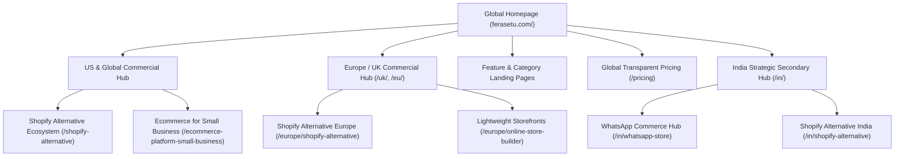
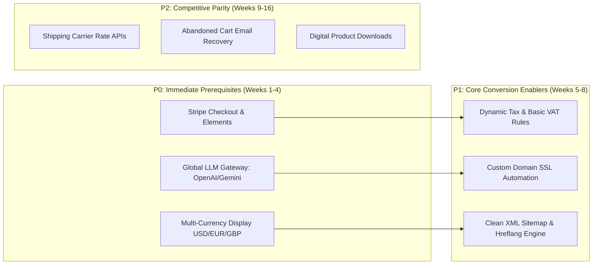
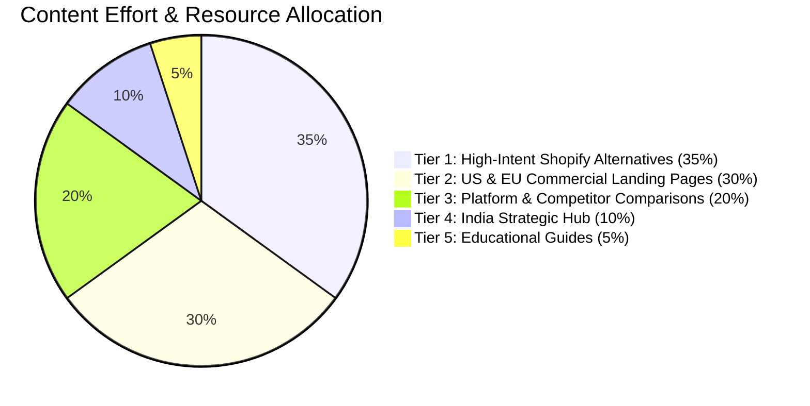
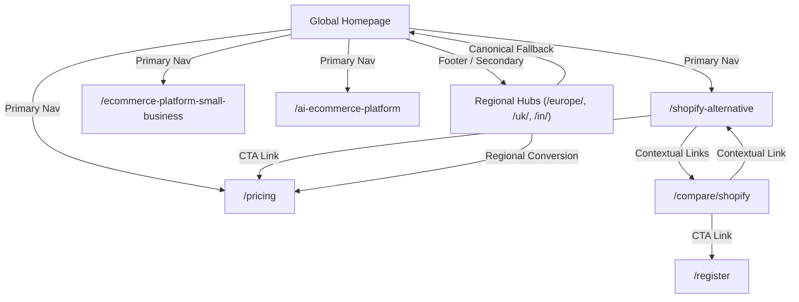
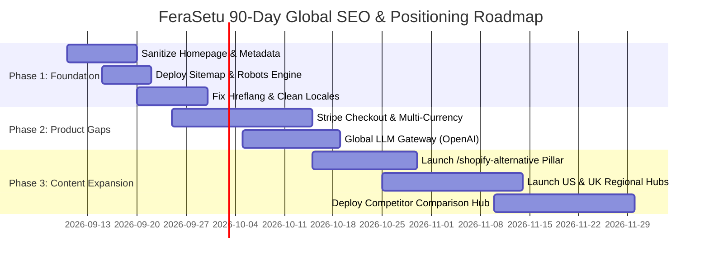

# FeraSetu Global Business & SEO Market Strategy

## Executive Summary & Core Business Context

**FeraSetu is a GLOBAL ecommerce SaaS platform.**

Its primary commercial mandate is to acquire high-intent merchants and small-to-medium businesses (SMBs) with proven purchasing power and willingness to pay sustainable software subscription fees ($19 to $79+/month). 

Historically, FeraSetu's codebase and early marketing materials were developed with an India-centric Kirana framing (*"Apni dukaan ko online le jao"*, WhatsApp ordering, direct UPI). This strategy document establishes a decisive commercial and architectural pivot:

1. **United States (Primary Market A — Highest Priority)**: 40% SEO resource allocation.
2. **Europe / UK / EU / EEA (Primary Market B — High Priority)**: 30% SEO resource allocation.
3. **Global / Language-Neutral English Intent (Secondary Tier)**: 15% SEO resource allocation.
4. **India (Secondary Strategic Branch — Localized)**: 10% SEO resource allocation.
5. **Emerging / Experimental Opportunities**: 5% SEO resource allocation.

India-specific search intent and product features remain supported, but **must not dominate** the homepage messaging, primary navigation, root canonical authority, page titles, or core competitive comparison architecture. India is sequestered into a dedicated, localized branch (`/in/` or vernacular clusters) to prevent cannibalization of high-value US and European commercial traffic.

---

## 1. Truthful Product Baseline & Codebase Audit

Ethical SEO requires that every claim, metadata snippet, and landing page be anchored in verified product capability. Below is the verified architectural reality of the FeraSetu codebase as audited:

| Layer | Verified Codebase Implementation | Operational Reality & SEO Implication |
| :--- | :--- | :--- |
| **Frontend Platform** | React + Vite (`frontend/`) and Next.js SSR (`marketing/`) | Public routes currently render via React SPA (`frontend/src/App.tsx`). High-performance Next.js SSR marketing exists in `marketing/` but is currently disconnected from root routing. |
| **Database & Runtime** | Cloudflare D1 / SQLite (`backend/src/models/database.ts`) | Single source of truth is Cloudflare D1. Globally distributed, low edge latency, suitable for global scale. |
| **Merchant Subscription Billing** | Razorpay in INR (`backend/src/routes/payment.ts`) | **CRITICAL PRODUCT GAP**: Backend only processes Razorpay in INR. Frontend `pricing.ts` has placeholder Stripe flags, but backend has no Stripe API or Webhook handlers. |
| **Storefront Shopper Checkout** | Cart Drawer & WhatsApp / Pickup OTP modal (`ProductGridSection.tsx`) | **CRITICAL PRODUCT GAP**: Storefronts rely on offline payment, pickup codes, and WhatsApp order handoffs. No native Stripe Elements credit card or digital wallet (Apple Pay, Google Pay) checkout exists. |
| **Artificial Intelligence Engine** | Sarvam AI (`sarvam-m` & `sarvam-105b` in `backend/src/services/sarvamAI.ts`) | **CRITICAL PRODUCT GAP**: Sarvam is an Indic-focused LLM provider. Its system prompt is explicitly hardcoded for Indian Kiranas. US/EU queries require routing to OpenAI / Anthropic / Gemini. |
| **Localization & Routing** | 22 Indian regional languages (`frontend/src/i18n/config.ts`) | **INTERNATIONAL SEO RISK**: Non-English languages fall back to English for untranslated strings, causing search engines to index identical English content under 19+ regional language codes. |
| **Crawlability & Sitemaps** | `robots.txt` lacks sitemap directive; `backend/src/routes/sitemap.ts` returns 404 | **TECHNICAL SEO DEFICIT**: Sitemaps are explicitly disabled. Root metadata hardcodes `en-IN` as locale. |
| **Regulatory & Compliance** | Terms & Privacy pages exist | **LEGAL BOUNDARY**: FeraSetu has **no** certified EU data residency, no GDPR DPA execution flow, and no automated VAT/sales tax calculation engine. |

> [!IMPORTANT]
> **Strict Content Rule**: We will NOT claim "GDPR Compliant", "EU Data Residency", "Automated EU VAT Calculation", or "US Sales Tax Remittance" anywhere on public marketing pages until the underlying backend services and legal documentation are deployed.

---

## 2. Core Positioning & Homepage Architecture

### 2.1 The Global Homepage Transformation
The current homepage (`frontend/src/pages/LandingPage.tsx`) leads with Hindi typography, Kirana-specific value props, and UPI payment trust badges. This must be refactored into a high-converting global SaaS experience.

* **Current Headline**: *"Apni dukaan ko online le jao. Orders badhao, business sambhalo — ek hi jagah se."*
* **New Global Positioning**: 
  * **Primary Hook**: *"The Zero-Bloat Online Store Builder with Built-in AI."*
  * **Supporting Value Proposition**: *"Launch an elegant, high-speed digital storefront in under 5 minutes. No complex plugins, no 30% marketplace commissions, and no technical debt. Just your products, your brand, and proactive AI assistance."*
  * **Target Audience**: Solopreneurs, boutique retailers, direct-to-consumer creators, and modern SMBs seeking freedom from Shopify's expensive app stack and WooCommerce's maintenance overhead.

### 2.2 Global Information Architecture


---

## 3. Market-by-Market Search Strategy

### 3.1 Primary Market A: United States (40% Allocation)

The US represents the largest commercial ecommerce software market, characterized by high Average Revenue Per User (ARPU) and high tolerance for monthly SaaS fees, but intense competition from incumbent platforms.

#### High-Intent Keyword Clusters
1. **The "Shopify Fatigue" Cluster (Commercial Investigation)**
   * `shopify alternative` (Volume: High | Intent: Commercial)
   * `shopify alternatives for small business` (Volume: Med | Intent: High Commercial)
   * `simple shopify alternative` (Volume: Med | Intent: High Commercial)
   * `affordable shopify alternative` (Volume: Med | Intent: Transactional)
   * `shopify competitor zero commission` (Volume: Low-Med | Intent: High Commercial)
   * `best alternative to shopify for beginners` (Volume: Med | Intent: Commercial)

2. **The Modern Small Business / Creator Storefront Cluster**
   * `ecommerce platform for small business` (Volume: Very High | Intent: Commercial)
   * `online store builder for startups` (Volume: Med | Intent: Commercial)
   * `easy online store builder` (Volume: High | Intent: Transactional)
   * `simple ecommerce website builder` (Volume: High | Intent: Transactional)
   * `minimalist ecommerce platform` (Volume: Low-Med | Intent: High Commercial)

3. **The AI-Native Commerce Cluster**
   * `AI ecommerce platform` (Volume: Growing | Intent: Commercial)
   * `AI online store builder` (Volume: Growing | Intent: High Commercial)
   * `AI ecommerce assistant` (Volume: Med | Intent: Informational/Commercial)
   * `ecommerce automation for small business` (Volume: Med | Intent: Commercial)

#### Strategic Angle for US Merchants
US merchants are exhausted by **"Shopify App Tax"**—the phenomenon where a \$39/month Shopify base plan skyrockets to \$250–\$500/month after installing 8–15 necessary third-party apps for reviews, page building, automated inventory, and basic SEO. FeraSetu positions itself as the **All-In-One Unified Storefront**: zero required plugins, zero transaction commissions, and proactive AI assistance out of the box.

---

### 3.2 Primary Market B: Europe & UK (30% Allocation)

European merchants require clarity, high data privacy standards, fair pricing, and straightforward merchant control. The European market is fragmented across currencies (EUR, GBP, CHF, SEK, etc.) and regional consumer expectations.

#### High-Intent Keyword Clusters
1. **UK Commercial Cluster**
   * `shopify alternative uk` (Volume: Med | Intent: High Commercial)
   * `ecommerce platform for small business uk` (Volume: Med | Intent: Commercial)
   * `online shop builder uk` (Volume: Med | Intent: Transactional)
   * `simple ecommerce platform uk` (Volume: Low-Med | Intent: Commercial)

2. **Continental Europe & EU Cluster**
   * `shopify alternative europe` / `shopify alternative eu` (Volume: Med | Intent: High Commercial)
   * `european ecommerce platform` (Volume: Med | Intent: Commercial)
   * `online store builder europe` (Volume: Med | Intent: Transactional)
   * `lightweight ecommerce software europe` (Volume: Low | Intent: Commercial)
   * `transparent pricing ecommerce platform` (Volume: Low | Intent: High Commercial)

#### Strict European Truthfulness & Legal Guidelines
To maintain complete integrity and avoid legal liability under EU consumer protection regulations:
* **GDPR Compliance**: Do **not** badge the site as "Certified GDPR Compliant" until standard Data Processing Addendums (DPAs), cookie consent banners (prior to analytics fire), and user data deletion APIs are fully integrated. Position honestly: *"FeraSetu never sells merchant or customer data, stores no unnecessary tracking cookies, and runs on Cloudflare's secure global edge."*
* **VAT / Taxes**: Do **not** claim "Automated EU VAT Calculation". State clearly: *"Flat catalog pricing with configurable manual tax rates. Full automated OSS/IOSS VAT integration scheduled on product roadmap."*
* **Data Residency**: Cloudflare D1 routes queries across a global distributed edge, but data storage at rest is managed within Cloudflare's primary region. Do not claim "100% EU Dedicated Data Residency".

---

### 3.3 Secondary Market: India (10% Allocation)

India remains an active market but is strictly demoted from the global entry experience.

#### Strategy & Guardrails
* **Isolate India Pages**: All Indian-specific content must reside under `/in/` or dedicated localized URLs (e.g., `/in/shopify-alternative`, `/in/online-store-builder`, `/in/whatsapp-store`).
* **De-index or Canonicalize Regional Language Stubs**: As audited, 19 of the 22 Indian regional languages have minimal translation depth and fall back to English. These must **either** be noindexed or canonicalized back to `/in/` or the primary English route to avoid massive duplicate content penalties.
* **Keep Core Features Intact**: WhatsApp ordering, UPI payment mechanisms, and mobile-first management tools continue to serve Indian merchants effectively on `/in/` routes.

---

### 3.4 Global / Language-Neutral English Intent (15% Allocation)

Target broader, non-geolocated commercial keywords on the root domain:
* `online store builder`
* `ecommerce website builder`
* `sell products online platform`
* `cloud ecommerce software`
* `catalog management software for small business`

---

## 4. The FeraSetu Positioning Test

Every successful challenger brand must survive direct comparison against category leaders. Below is the truthful, verified positioning test across all major competitors:

```mermaid
quadrantChart
    title Ecommerce Market Complexity vs All-in-One AI Native
    x-axis Low Technical Complexity --> High Technical Complexity / Developer Heavy
    y-axis Fragmented App Ecosystem --> Unified Native AI & Commerce
    quadrant-1 Complex Headless / Enterprise
    quadrant-2 FeraSetu Sweet Spot (Zero-Bloat AI Store)
    quadrant-3 Drag-and-Drop Builders (Wix, Squarespace)
    quadrant-4 Monolithic Heavyweights (Shopify, WooCommerce, Shopware)
    "Shopify": [0.65, 0.25]
    "WooCommerce": [0.85, 0.15]
    "Wix": [0.25, 0.35]
    "Shopware": [0.80, 0.30]
    "FeraSetu": [0.20, 0.85]
```

### 4.1 Why should a US merchant choose FeraSetu over Shopify?

* **The Honest Truth**: 
  * If a merchant requires an enterprise POS system for 50 retail locations, an app store with 8,000 plugins, or complex multi-warehouse inventory routing across 10 dropshipping vendors, **Shopify is the superior platform**.
* **Why Choose FeraSetu**:
  1. **Zero App Bloat**: Shopify requires third-party monthly subscriptions for basic capabilities like product add-ons, invoice generation, custom forms, and inventory alerts. FeraSetu includes core commerce tools natively.
  2. **Predictable Flat Pricing**: FeraSetu charges a flat monthly fee (\$19/mo Starter, \$49/mo Pro) with **0% platform transaction fees**. Shopify penalizes merchants with additional transaction fees (0.5% to 2.0%) unless they use Shopify Payments.
  3. **Embedded Business Intelligence AI**: Fera AI is not an expensive \$30/month app plugin; it is integrated directly into the database, advising merchants on low stock, catalog improvements, and sales trends.
* **Product Gaps That Must Be Closed**:
  * Native Stripe Credit Card Checkout (Apple Pay, Google Pay).
  * Direct shipping label purchasing (e.g., Shippo / EasyPost integration).

### 4.2 Why should a European merchant choose FeraSetu over Shopify?

* **The Honest Truth**:
  * Shopify has established local entity infrastructure in every major European country.
* **Why Choose FeraSetu**:
  1. **Radical Simplicity & Speed**: Zero setup bloat. A merchant can publish a live storefront in 3 minutes without configuring complex theme Liquid code.
  2. **Clean Edge Performance**: Running on Cloudflare edge means ultra-fast Time to First Byte (TTFB) across London, Frankfurt, Paris, Amsterdam, and Stockholm without heavy CDN caching plugins.
  3. **No Hidden Transaction Penalties**: Fair, transparent pricing with no currency conversion penalties or gateway lock-in.
* **Product Gaps That Must Be Closed**:
  * Multi-currency EUR/GBP storefront display and settlement.
  * Compliant B2B invoicing with VAT reverse-charge fields.

### 4.3 Why should a merchant choose FeraSetu over WooCommerce?

* **The Honest Truth**:
  * WooCommerce has endless open-source customizability and thousands of free WordPress plugins.
* **Why Choose FeraSetu**:
  1. **Zero Hosting & Security Headaches**: WooCommerce sites break constantly when WordPress, PHP, or WooCommerce plugin versions conflict. Security vulnerabilities, malware injections, and slow shared hosting are notorious issues. FeraSetu is fully managed SaaS on Cloudflare D1.
  2. **Zero Maintenance Costs**: WooCommerce appears "free," but merchants routinely spend \$30–\$100/month on managed hosting (WP Engine/Kinsta), premium security (Wordfence), SSL, caching plugins, and developer troubleshooting. FeraSetu has zero infrastructure maintenance.
  3. **Instant Modern Dashboard**: WooCommerce's backend is cluttered with generic WordPress admin menus. FeraSetu provides a dedicated, lightning-fast commercial operations dashboard.

### 4.4 Why should a merchant choose FeraSetu over Wix?

* **The Honest Truth**:
  * Wix provides an unstructured free-form visual drag-and-drop canvas suitable for wedding websites, restaurants, and personal portfolios.
* **Why Choose FeraSetu**:
  1. **Commerce-First Architecture**: Wix treats ecommerce as an add-on widget bolted onto a generic page layout engine, often resulting in sluggish mobile performance, broken responsive layouts, and messy DOM structures. FeraSetu is engineered specifically around structured product catalogs, clean schema markup, and rapid order fulfillment.
  2. **AI Action Execution**: Wix offers generic generative text tools. FeraSetu's AI executes structured database mutations (e.g., adding structured products, bulk price adjustments, stock threshold alerts) directly within the merchant workflow.

### 4.5 What can FeraSetu uniquely own in search?

FeraSetu cannot win search by fighting head-to-head on high-volume generic keywords like "ecommerce website" against multi-billion dollar public companies.

**FeraSetu can uniquely own:**
> **"The fastest, zero-bloat, AI-assisted ecommerce platform for solo merchants and growing brands who want a modern storefront without the Shopify app tax."**

Specific long-tail queries FeraSetu can conquer:
* `minimalist shopify alternative for small catalogs`
* `zero commission ecommerce platform for startups`
* `simple store builder with built in ai assistant`
* `flat rate ecommerce software without plugin fees`
* `lightweight online store builder for creators`

---

## 5. Competitor Feature Analysis: The 8-Question Evaluation Matrix

To prevent the engineering team from wasting months cloning features that don't matter to high-paying US and European merchants, every feature must be evaluated through this rigorous 8-question framework:

1. **Table Stakes?**: Is checkout impossible without it?
2. **US Importance?**: Does a US merchant expect it on day one?
3. **EU Importance?**: Does an EU merchant require it for legal or local adoption?
4. **India Importance?**: Is it relevant to the strategic secondary market?
5. **FeraSetu Strategic Value?**: Does it reinforce our lightweight AI-first core?
6. **SEO Impact?**: Does it unlock high-intent search queries?
7. **Conversion Impact?**: Does its absence cause immediate visitor bounce?
8. **Differentiator?**: Can we build it better or simpler than incumbents?

| Feature | 1. Table Stakes | 2. US Imp. | 3. EU Imp. | 4. IN Imp. | 5. Strategic Value | 6. SEO Impact | 7. Conversion Impact | 8. Differentiator | Verdict & Action |
| :--- | :---: | :---: | :---: | :---: | :---: | :---: | :---: | :---: | :--- |
| **Native Stripe Credit Card / Apple Pay** | **YES** | **Critical** | **Critical** | Low | **High** | High | **Decisive** | Table Stakes | **P0 Urgent Gap**: Must build immediately. |
| **Multi-Currency (USD, EUR, GBP, INR)** | **YES** | Medium | **Critical** | Low | **High** | High | **Decisive** | Medium | **P0 Urgent Gap**: Storefront currency switcher. |
| **Zero App Store Unified Architecture** | No | **High** | **High** | Medium | **Highest** | **High** | High | **Strongest** | **Core Positioning**: Lead with this in all copy. |
| **Embedded AI Operations Assistant** | No | **High** | Medium | High | **Highest** | **High** | High | **Strongest** | **Core Positioning**: Upgrade from Sarvam to OpenAI/Claude. |
| **Automated EU VAT / Tax Rules** | No | Low | **Critical** | Low | Medium | Medium | **Decisive (EU)** | Low | **P1 Gap**: Stripe Tax or simple rules integration. |
| **Direct Shipping Label Printing** | Medium | **High** | Medium | Low | Medium | Medium | High | Low | **P2 Gap**: Integrate Shippo/EasyPost API later. |
| **WhatsApp-Only Checkout Flow** | No | Low | Zero | **Critical** | Low (Global) | Low | Negative (US/EU) | Negative | **Isolate to India**: Remove from US/EU checkout. |
| **Direct UPI QR Checkout** | No | Zero | Zero | **Critical** | Low (Global) | Low | Negative (US/EU) | Negative | **Isolate to India**: Restrict to `/in/` routing. |
| **Complex App Marketplace (8000+ apps)** | No | Low | Low | Low | **Negative** | Medium | Low | Anti-Feature | **DO NOT BUILD**: We eliminate app bloat, not replicate it. |

---

## 6. Product Gap Prioritization & Strategic Classification Matrix

Any feature that FeraSetu does not currently support is treated as a **Product Gap** candidate. Every gap is evaluated by:
* **Strategic Value** (Alignment with zero-bloat AI vision)
* **Customer Value** (Willingness to pay & retention)
* **Revenue Potential** (Unlocks US/EU \$19–\$49/mo subscriptions)
* **SEO Value** (Unlocks search queries with commercial intent)
* **Engineering Cost** (Complexity in sprint weeks)
* **Defensibility** (Competitive moat)



### Strategic Gap Breakdown Table

| Gap Candidate | Strategic Value | Customer Value | Revenue Potential | SEO Value | Engineering Cost | Defensibility | Priority Level |
| :--- | :---: | :---: | :---: | :---: | :---: | :---: | :--- |
| **Stripe Merchant & Checkout Integration** | High | Maximum | Maximum | High | 2 Weeks | Low (Standard) | **P0 — Critical** |
| **Multi-Currency Storefront Engine** | High | Maximum | Maximum | High | 1.5 Weeks | Medium | **P0 — Critical** |
| **Global LLM Provider Gateway (OpenAI/Anthropic)** | Maximum | High | High | High | 1 Week | High | **P0 — Critical** |
| **Automated XML Sitemap & SEO Canonical Router** | High | Medium | Medium | Maximum | 0.5 Weeks | Low | **P0 — Critical** |
| **GDPR Privacy Center & Cookie Compliance** | Medium | High (EU) | High (EU) | Medium | 1 Week | Medium | **P1 — High** |
| **Automated Tax Calculation (Stripe Tax)** | Medium | High | High | Medium | 2 Weeks | Low | **P1 — High** |
| **Automated Abandoned Cart Email Recovery** | High | High | High | Medium | 2 Weeks | Medium | **P1 — High** |
| **Shipping Carrier Integrations (USPS/UPS/DHL)** | Medium | High (US) | Medium | Medium | 3 Weeks | Low | **P2 — Medium** |
| **Digital Products & File Download Delivery** | High | High | High | High | 2 Weeks | Medium | **P2 — Medium** |
| **Point-of-Sale (POS) Hardware Support** | Low | Low (SMB) | Low | Low | 12+ Weeks | Low | **Backlog / Reject** |

---

## 7. International SEO & Technical Architecture

### 7.1 URL Taxonomy & Routing Strategy

A critical error in early localization is creating shallow, machine-translated doorway pages across multiple country codes, or maintaining un-translated language prefixes that duplicate canonical content.

FeraSetu adopts the **Single Global Root with Regional Differentiation** model:

```
ferasetu.com/                                -> Global / US Default (English)
ferasetu.com/pricing                         -> Global Pricing (GeoIP auto-currency)
ferasetu.com/shopify-alternative             -> Global / US Shopify Alternative Hub
ferasetu.com/ecommerce-platform-small-business -> Global SMB Hub

ferasetu.com/europe/                         -> Europe Regional Landing Page
ferasetu.com/europe/shopify-alternative      -> Europe-specific Comparison Hub
ferasetu.com/uk/                             -> UK-specific Commercial Hub

ferasetu.com/in/                             -> India Strategic Gateway (English)
ferasetu.com/in/shopify-alternative          -> India Shopify Comparison (Pricing in INR)
ferasetu.com/in/whatsapp-store               -> India WhatsApp Commerce Hub
```

#### Why NOT `/en-us/`, `/en-gb/`, `/en-eu/` for identical content?
Creating separate URLs like `/en-us/shopify-alternative` and `/en-gb/shopify-alternative` when 95% of the English copy is identical invites algorithmic duplicate content consolidation and fractures backlink authority. 
* **The Solution**: The root domain (`ferasetu.com/`) serves US and Global English intent directly. Regional subpaths (`/europe/`, `/uk/`, `/in/`) are only deployed where **genuinely differentiated information** (local currency, regional merchant case studies, specific payment considerations, or market-specific logistical guides) exists.

### 7.2 Hreflang and Canonical Architecture
The current implementation in `frontend/src/components/SEO.tsx` iterates through all 22 Indian regional languages and outputs `<link rel="alternate" hreflang="...">` tags even when the underlying page contains un-translated English fallback text. This must be corrected immediately.

#### Strict Rules for Canonical & Hreflang:
1. **Self-Referential Canonicals**: Every indexable page must have a self-referential canonical tag pointing to its absolute, trailing-slash-normalized URL:
   ```html
   <link rel="canonical" href="https://ferasetu.com/shopify-alternative" />
   ```
2. **Hreflang Only for Genuinely Translated Content**:
   * Omit hreflang tags for languages that rely on English dictionary fallback stubs.
   * Root global pages declare:
     ```html
     <link rel="alternate" hreflang="x-default" href="https://ferasetu.com/" />
     <link rel="alternate" hreflang="en" href="https://ferasetu.com/" />
     ```
   * India regional routes:
     ```html
     <link rel="alternate" hreflang="en-IN" href="https://ferasetu.com/in/" />
     <link rel="alternate" hreflang="hi-IN" href="https://ferasetu.com/in/hi/" />
     ```

### 7.3 Pricing SEO Architecture

#### Commercial Currency Expectations
* **United States**: \$19/month Starter, \$49/month Pro.
* **Europe / Eurozone**: €19/month Starter, €49/month Pro (Prices exclusive of VAT where applicable).
* **United Kingdom**: £19/month Starter, £49/month Pro.
* **India (Secondary)**: ₹399/month Business, ₹999/month Pro (Inclusive of GST where applicable).

#### Indexation & Currency Strategy
* **Single Indexable URL**: `/pricing` is the single canonical indexable pricing page.
* **DO NOT** create separate URLs like `/pricing-usd`, `/pricing-eur`, `/pricing-gbp`, and `/pricing-inr`. This creates severe index bloat and keyword cannibalization.
* **Client-Side GeoIP Presentation**: The `/pricing` page reads the visitor's edge location via Cloudflare headers (`CF-IPCountry`) and defaults the visual currency toggle accordingly (USD for US/Global, EUR for Eurozone, GBP for UK, INR for India), allowing the user to freely toggle currencies via a visible UI selector without changing the canonical URL.
* **Structured Data**: The Schema.org `Product` / `Offer` metadata on `/pricing` should declare the primary global tier in USD with multi-offer extensions for regional parity:
  ```json
  {
    "@context": "https://schema.org",
    "@type": "SoftwareApplication",
    "name": "FeraSetu Ecommerce Platform",
    "offers": [
      {
        "@type": "Offer",
        "price": "19.00",
        "priceCurrency": "USD",
        "name": "Starter Plan (US/Global)"
      },
      {
        "@type": "Offer",
        "price": "19.00",
        "priceCurrency": "EUR",
        "name": "Starter Plan (Europe)"
      },
      {
        "@type": "Offer",
        "price": "399.00",
        "priceCurrency": "INR",
        "name": "Business Plan (India)"
      }
    ]
  }
  ```

---

## 8. High-Priority Keyword Clusters & Content Hierarchy

Content creation must follow a disciplined, 4-tier hierarchy dictated by commercial intent, search demand, conversion probability, and product capability:



### Tier 1: Core Commercial Demand (Highest Priority)
*Target: Merchants actively looking to migrate or launch on an alternative platform.*

| Target Keyword Phrase | Search Intent | Target URL | Primary Angle / Hook |
| :--- | :--- | :--- | :--- |
| `shopify alternative` | Commercial Investigation | `/shopify-alternative` | "Why pay for 15 apps? The zero-bloat Shopify alternative with built-in AI." |
| `shopify alternatives for small business` | Commercial Investigation | `/shopify-alternatives-small-business` | "Affordable, lightweight ecommerce for independent brands." |
| `shopify alternative for startups` | Commercial Investigation | `/shopify-alternative-startups` | "Launch your store in 5 minutes with zero technical overhead." |
| `affordable shopify alternative` | Transactional | `/affordable-shopify-alternative` | "Flat pricing, 0% transaction commissions, zero app subscriptions." |
| `online store builder` | High Commercial | `/online-store-builder` | "Build and launch your branded digital storefront today." |
| `ecommerce platform for small business` | Commercial | `/ecommerce-platform-small-business` | "Complete catalog, orders, and AI intelligence in one workspace." |

### Tier 2: US & European Commercial Intent
*Target: Regionally anchored commercial searches.*

| Target Keyword Phrase | Region | Target URL | Primary Angle / Hook |
| :--- | :---: | :--- | :--- |
| `shopify alternative us` | US | `/us/shopify-alternative` | "Built for US small businesses. Zero transaction fee platform." |
| `simple ecommerce platform usa` | US | `/us/simple-ecommerce-platform` | "Skip complex configurations. Fast cloud storefronts." |
| `shopify alternative uk` | UK | `/uk/shopify-alternative` | "Transparent GBP pricing. No surprise plugin costs." |
| `ecommerce platform for small business uk` | UK | `/uk/ecommerce-platform-small-business` | "High-speed UK edge storefronts with zero maintenance." |
| `shopify alternative europe` | EU | `/europe/shopify-alternative` | "Streamlined European ecommerce without platform tax." |
| `online shop builder europe` | EU | `/europe/online-store-builder` | "Fast, clean European online stores powered by edge cloud." |

### Tier 3: Competitor Comparison Ecosystem
*Target: Direct head-to-head comparison searches.*

| Target Keyword Phrase | Target URL | Objective & Narrative |
| :--- | :--- | :--- |
| `ferasetu vs shopify` | `/compare/shopify` | Deep, honest breakdown: When to choose Shopify (large enterprise) vs FeraSetu (lean brands). |
| `ferasetu vs woocommerce` | `/compare/woocommerce` | Cloud SaaS vs Self-Hosted WordPress: Eliminating plugin vulnerabilities and server fees. |
| `ferasetu vs wix` | `/compare/wix` | Purpose-built commerce engine vs drag-and-drop website builder. |
| `ferasetu vs bigcommerce` | `/compare/bigcommerce` | Lightweight speed vs complex enterprise middleware. |
| `ferasetu vs squarespace` | `/compare/squarespace` | Commercial sales engine vs static design portfolio builder. |

### Tier 4: India Strategic Hub (Secondary)
*Target: Strategic Indian merchant search queries.*

| Target Keyword Phrase | Target URL | Objective & Narrative |
| :--- | :--- | :--- |
| `shopify alternative india` | `/in/shopify-alternative` | Affordable INR pricing, UPI payments, Indian retail support. |
| `whatsapp commerce platform` | `/in/whatsapp-store` | Turn WhatsApp conversations into a structured online catalog. |
| `online dukaan builder` | `/in/online-dukaan` | Guided Hindi and vernacular store creation. |

---

## 9. Internal Linking & Authority Flow Architecture

PageRank and internal link authority must be concentrated where commercial conversion occurs:



### Strategic Internal Linking Rules:
1. **Homepage Link Equity**: The homepage header navigation must link exclusively to **Global Commercial Tier 1** pages (`Shopify Alternative`, `Platform`, `AI Store Builder`, `Pricing`). India-specific links must live in a subtle regional selector or footer.
2. **Contextual Up-Linking**: Every comparison page (`/compare/shopify`, `/compare/woocommerce`) must link back up to the primary `/shopify-alternative` pillar page using exact-match descriptive anchor text.
3. **No Dead-End Pages**: Every informational or comparison landing page must terminate in a clear, high-contrast primary conversion action directing to `/register` or `/pricing`.

---

## 10. Technical SEO Specifications & Fixes

To achieve immediate indexation and high ranking on Google US and European search indexes, the following technical prerequisites must be executed:

### 10.1 Real Dynamic XML Sitemap
The current stub returning a 404 in `backend/src/routes/sitemap.ts` must be replaced with an automated XML generator that dynamically lists all published public marketing pages, comparison pages, and public merchant store subdomains.

```xml
<?xml version="1.0" encoding="UTF-8"?>
<urlset xmlns="http://www.sitemaps.org/schemas/sitemap/0.9">
  <url>
    <loc>https://ferasetu.com/</loc>
    <changefreq>weekly</changefreq>
    <priority>1.0</priority>
  </url>
  <url>
    <loc>https://ferasetu.com/shopify-alternative</loc>
    <changefreq>weekly</changefreq>
    <priority>0.9</priority>
  </url>
  <url>
    <loc>https://ferasetu.com/pricing</loc>
    <changefreq>weekly</changefreq>
    <priority>0.8</priority>
  </url>
  <!-- Regional Hubs -->
  <url>
    <loc>https://ferasetu.com/europe/</loc>
    <changefreq>weekly</changefreq>
    <priority>0.7</priority>
  </url>
  <url>
    <loc>https://ferasetu.com/in/</loc>
    <changefreq>weekly</changefreq>
    <priority>0.6</priority>
  </url>
</urlset>
```

### 10.2 Robots.txt Configuration
Update `frontend/public/robots.txt` to explicitly guide web crawlers and state the sitemap location:
```text
User-agent: *
Allow: /
Disallow: /dashboard/
Disallow: /admin/
Disallow: /settings/
Disallow: /api/
Disallow: /callback

Sitemap: https://ferasetu.com/sitemap.xml
```

### 10.3 Core Web Vitals & Edge Performance
* **TTFB (Time to First Byte)**: Ensure Cloudflare edge caching serves public static pages in `< 50ms` globally.
* **LCP (Largest Contentful Paint)**: Hero imagery must be delivered in optimized WebP format with explicit `width` and `height` attributes to prevent layout shift (CLS `< 0.05`).
* **Client Hydration**: Public landing pages should minimize heavy JavaScript execution during initial parse.

---

## 11. Resource Allocation & Execution Roadmap

### 11.1 Strategic Effort Allocation
* **United States SEO (40%)**: Development of Tier 1 Shopify alternative pillar pages, US startup landing pages, and competitive comparison matrices.
* **Europe & UK SEO (30%)**: Development of UK and EU solution hubs, transparent pricing documentation, and European edge performance benchmarking.
* **Global English Intent (15%)**: Platform overview pages, AI commerce architecture features, and core storefront functionality.
* **India Strategic Branch (10%)**: Maintaining and isolating `/in/` routes, WhatsApp ordering updates, and localized vernacular landing pages.
* **Experimental & Emerging (5%)**: Voice-to-store creation, AI agentic checkout research, and social-first selling formats.

### 11.2 Phased 90-Day Implementation Milestones



#### Phase 1 (Days 1–30): Foundation & Technical Alignment
* Refactor global homepage (`LandingPage.tsx`) to global English, removing Kirana-exclusive slogans.
* Update `SEO.tsx` and HTML metadata: change default locale to `en_US`, sanitize hreflang generation, and remove automatic generation of 22 untranslated language tags.
* Deploy dynamic XML sitemap and updated `robots.txt`.
* Restructure Indian content cleanly under `/in/`.

#### Phase 2 (Days 31–60): Critical Product Gap Closure
* Implement backend Stripe integration for USD, EUR, and GBP merchant subscriptions and storefront checkout.
* Add global LLM fallback (OpenAI/Anthropic) to Fera AI service for English and European language queries.
* Implement dynamic GeoIP currency toggle on `/pricing`.

#### Phase 3 (Days 61–90): Content Pillar & Comparison Rollout
* Publish primary pillar: `https://ferasetu.com/shopify-alternative`.
* Publish regional commercial hubs: `/europe/shopify-alternative` and `/uk/shopify-alternative`.
* Deploy direct comparison matrices: `/compare/shopify`, `/compare/woocommerce`, and `/compare/wix`.
* Begin continuous Search Console tracking and iterate based on US/EU impression and conversion signals.

---

## 12. Final Business Principle

> **FeraSetu does not attempt to be everything to every merchant.**
> 
> We do not compete with Shopify's 8,000-app enterprise sprawl, nor with WooCommerce's complex self-hosted developer ecosystem. 
>
> FeraSetu succeeds globally by being **the most compelling, zero-bloat, transparently priced online store builder for modern independent merchants who want to launch fast, avoid unexpected plugin taxes, and grow with built-in AI assistance.**
>
> Our SEO architecture is engineered to capture that exact commercial audience in the United States and Europe.
